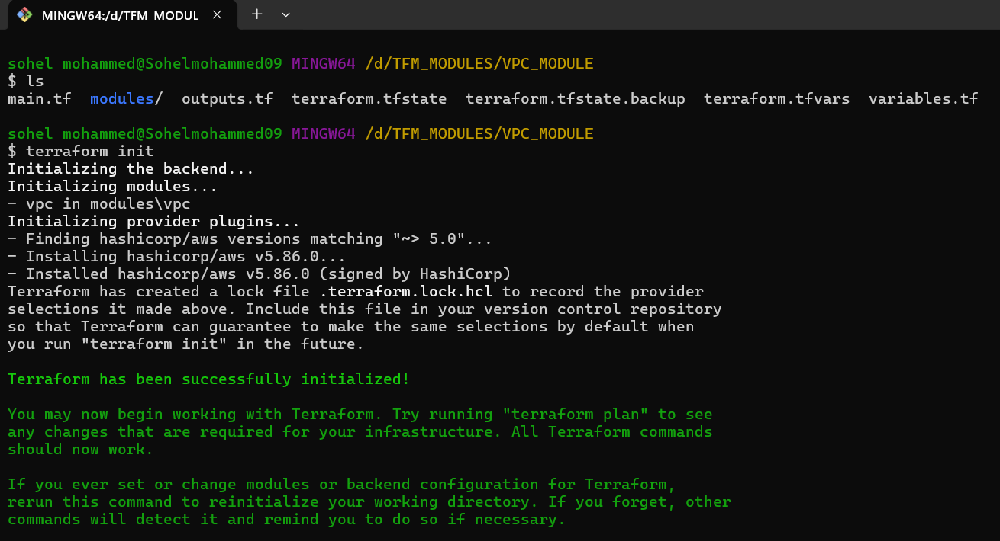
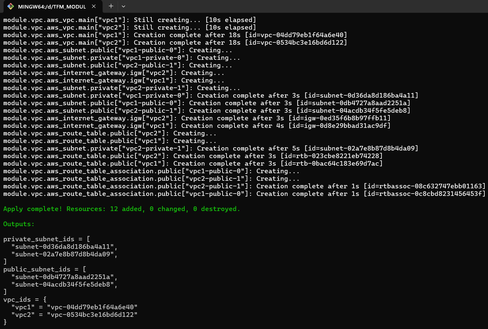
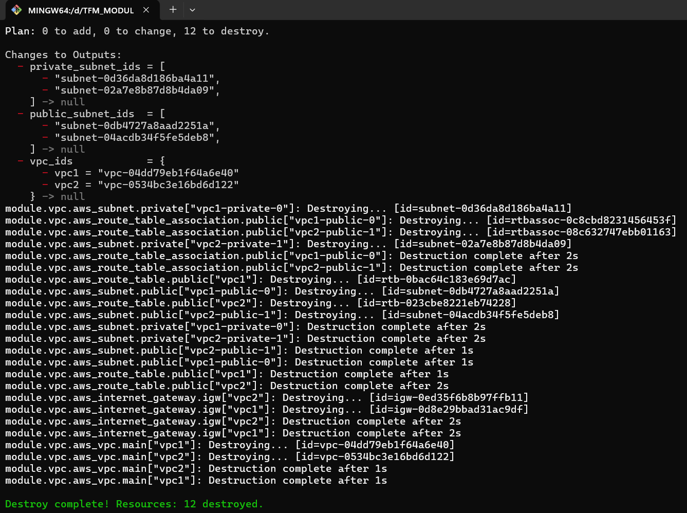

# Terraform VPC (Virtual Private Cloud) Module

## Overview
This repository contains a Terraform module for creating and managing an VPC (Virtual Private Cloud) using Infrastructure as Code (IaC). The module is designed to be reusable and follows best practices for scalability and maintainability.

## What Are Terraform Modules?
Terraform modules are self-contained packages of Terraform configurations that allow for the reuse of code. A module consists of `.tf` files that define infrastructure resources and can be called from a root module to provision resources in a structured manner.

### Advantages of Terraform Modules
1. **Reusability:** Modules allow code to be reused across multiple projects, reducing duplication.
2. **Maintainability:** Easier to manage and update infrastructure by organizing it into logical components.
3. **Scalability:** Enables modular scaling of infrastructure without affecting other components.
4. **Collaboration:** Teams can work on different modules independently and integrate them seamlessly.
5. **Encapsulation:** Hides complex logic behind simple input variables, making configuration simpler.
6. **Version Control:** Modules can be versioned, enabling better change management and rollback capabilities.
7. **Efficiency:** Faster deployment and better control over infrastructure lifecycle.
8. **Security:** Allows centralized policy enforcement and better resource management.

## Repository Structure
```
/
├── main.tf               # Root Terraform configuration
├── variables.tf          # Input variable definitions
├── outputs.tf            # Output values
├── terraform.tfvars      # Variable values (not included in version control)
├── modules/
│   └── VPC_(Virtual Private Cloud)/        # Terraform module for VPC (Virtual Private Cloud)
│       ├── main.tf       # Resource definitions
│       ├── variables.tf  # Module input variables
│       ├── outputs.tf    # Module output values
└── README.md             # Project documentation
```

## How to Use This Module
1. **Clone the Repository:**
   ```sh
   git clone https://github.com/sohelmohammed0/VPC_MODULE.git
   cd VPC_MODULE
   ```
2. **Initialize Terraform:**
   ```sh
   terraform init
   ```

   


3. **Plan the Deployment:**
   ```sh
   terraform plan
   ```
4. **Apply the Configuration:**
   ```sh
   terraform apply -auto-approve
   ```

   

5. **Destroy Resources (if needed):**
   ```sh
   terraform destroy -auto-approve
   ```

   

## Prerequisites
- Terraform installed on your system (>= 1.0.0)
- AWS credentials configured for authentication

## Best Practices for Using Terraform Modules
- Keep modules versioned and documented.
- Use variables for flexibility and customization.
- Follow naming conventions for resources and modules.
- Avoid hardcoding sensitive values; use environment variables or secret management tools.
- Implement state management using Terraform Cloud or remote backends for team collaboration.
- Use Terraform workspaces for managing multiple environments efficiently.

## Useful Links
- Terraform Official Documentation: [Terraform Docs](https://developer.hashicorp.com/terraform/docs)
- AWS VPC Documentation: [AWS VPC Docs](https://docs.aws.amazon.com/vpc/)
- GitHub Repository: [GitHub Repo](https://github.com/sohelmohammed0/VPC_MODULE.git)

## Conclusion
Using Terraform modules enhances infrastructure automation by making configurations modular, scalable, and reusable. This VPC module provides a structured approach to managing storage resources efficiently while ensuring best practices for infrastructure management.

